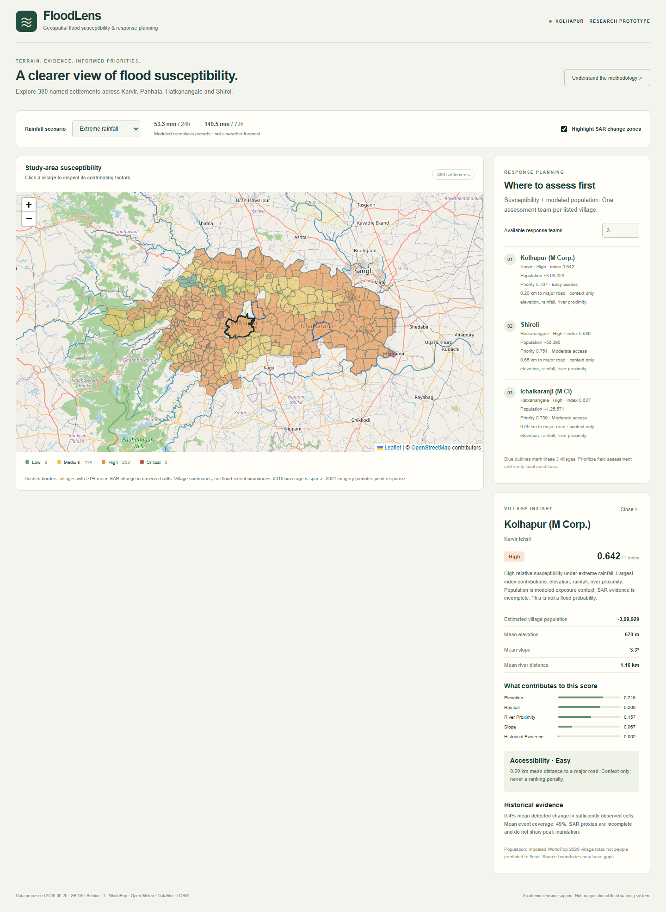
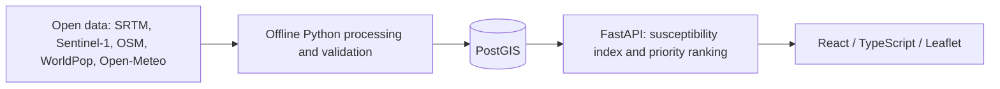

# FloodLens

**Real geospatial evidence → relative flood susceptibility → explainable response priorities.**

FloodLens helps explore flood-prone settlements in Karvir, Panhala, Hatkanangale and Shirol, Kolhapur, Maharashtra. It combines terrain, river proximity, historical satellite change, rainfall scenarios and modeled population to show where limited assessment teams could look first.



**Status: FLOODLENS COMPLETE — Gate D passed on 30 September 2026.** M0–M8 are complete under the documented Gate A/B reduced scope. The GitHub repository remains private.

[Open the live dashboard](https://floodlens-lilac.vercel.app) · [API documentation](https://floodlens-nz9r.onrender.com/docs) · [Production walkthrough video](docs/evidence/floodlens-production-demo.webm)

## Why this project

Flood response requires comparing places under limited capacity. A colored hazard map alone does not explain why a village ranks higher or how population changes the assessment order. FloodLens keeps both the susceptibility factors and the separate priority formula visible.

## Working features

- 380 source settlements, backed by 38,083 real 250 m analysis cells in PostGIS.
- Interactive Leaflet choropleth, waterways and an explicitly labeled SAR evidence summary.
- Normal / Heavy / Extreme rainfall presets calibrated from reanalysis climatology.
- Village detail with raw terrain values, index contributions, population estimates and missing evidence.
- Configurable team count, deterministic Top-N priorities and synchronized map outlines.
- FastAPI GeoJSON/JSON endpoints, Alembic migrations, real-data seed and automated tests.

## Architecture



Stack: Python 3.12, FastAPI, SQLAlchemy/pg8000, PostgreSQL/PostGIS, GeoPandas/Rasterio/Shapely, Earth Engine, React 19, TypeScript, Vite, Leaflet and Docker. Offline rasters are excluded from the runtime and repository.

## Methodology and evaluation

Gate B selected the PRD-approved **susceptibility index**, because 2019 SAR coverage is only 5.9% and the available 2021 scene precedes documented peak response. There is no trained classifier, probability calibration or claimed ML accuracy.

The index weights normalized low elevation (25%), river proximity (30%), flatter terrain (10%), historical change (15%) and rainfall (20%). Exact normalization, missing-value rules and literature rationale are in [methodology](docs/methodology.md). Cell scores are area-weighted into source village boundaries.

Priority uses exactly:

`priority = 0.65 × susceptibility + 0.35 × normalized_population`

Population uses a study-wide log normalization. Missing population remains null in outputs and uses the known study median only for ranking. Ties sort by village ID. Accessibility is displayed separately; historical severity is not counted twice. All weights and category bands are transparent prototype choices, not validated emergency policy.

## Run locally

Prerequisites: Docker Desktop (Linux containers), Git and Node.js 22.12+.

```powershell
Copy-Item .env.example .env
docker compose up -d --wait db
docker compose build api
docker compose run --rm api alembic -c backend/alembic.ini upgrade head
docker compose run --rm api python -m data_pipeline.seed
docker compose run --rm api python -m data_pipeline.score
docker compose up -d --wait api
cd frontend
npm ci
npm run dev
```

Open http://localhost:5173. API docs: http://localhost:8000/docs. The checked-in processed seed works without Earth Engine credentials. See [the fresh-clone guide](docs/local-development.md) for isolated-stack ports and full pipeline reproduction.

## Tests

```powershell
docker compose run --rm api python -m pytest backend/tests -q
cd frontend
npm test
npm run lint
npm run build
```

Final verification: **57 Python tests passed against both local PostGIS and production Supabase**, plus **6 frontend tests**, Ruff, Black, frontend lint and build. Read-only production database tests used verified TLS and production CORS settings. Two upstream deprecation warnings remain; no tests were skipped. M7 already verified real-data validation and a literal fresh GitHub clone. [Gate D evidence](docs/gate-d.md) records the final checks.

Run the production browser check with `APP_URL=https://floodlens-lilac.vercel.app`, `API_BASE_URL=https://floodlens-nz9r.onrender.com`, an installed Playwright module and Edge: `node scripts/verify-production.cjs`. It writes screenshots, video and machine-readable results to `docs/evidence/`.

## Demo and documentation

Follow [the two-minute walkthrough](docs/demo.md) on the [live dashboard](https://floodlens-lilac.vercel.app). [Watch the recorded production demo](docs/evidence/floodlens-production-demo.webm). Desktop, mobile and methodology screenshots were captured from the public deployment.

- [Architecture](docs/architecture.md) · [Sources and licenses](docs/data-sources.md)
- [Methodology](docs/methodology.md) · [Scoring card](docs/model-card.md) · [Limitations](docs/limitations.md)
- [Student learning notes](docs/learning-notes.md) · [Deployment](docs/deployment.md)
- [Approved PRD](docs/floodlens_final_prd.md) · [Milestone records](docs/milestones)

## Responsible use and limitations

This academic prototype estimates relative susceptibility, not the exact timing, depth, location or severity of a future flood. It must never be the sole basis for evacuation or resource deployment. SAR proxies are incomplete; reanalysis is modeled rainfall; WorldPop is modeled 2020 population. Nine settlements have unknown population. Source boundaries include towns as well as rural villages and have unresolved gaps. Large settlements can lead population-aware priorities.

## Deployment and future work

Deployed on Vercel Hobby (frontend), Render Free (API) and Supabase Free (PostGIS). A fresh browser loaded all 380 settlements in 16.8 seconds in the final recorded check; the complete desktop/mobile workflow took 76.5 seconds. A sleeping Render instance can take longer. Free-tier quotas and cold starts limit availability; the production recording provides a backup demo. This test used a fresh browser session, not a deliberately suspended backend.

Future work: independent flood-label validation and sensitivity assessment, improved boundary/population completeness, river gauges and forecast inputs, then additional tehsils and explicit multi-resource/travel-time constraints. These are not implemented features.

## License

Software: [MIT](LICENSE). Source-derived data retains upstream terms, including DataMeet/OSM ODbL and WorldPop CC BY 4.0; see [processed-data attribution](data/processed/README.md).
