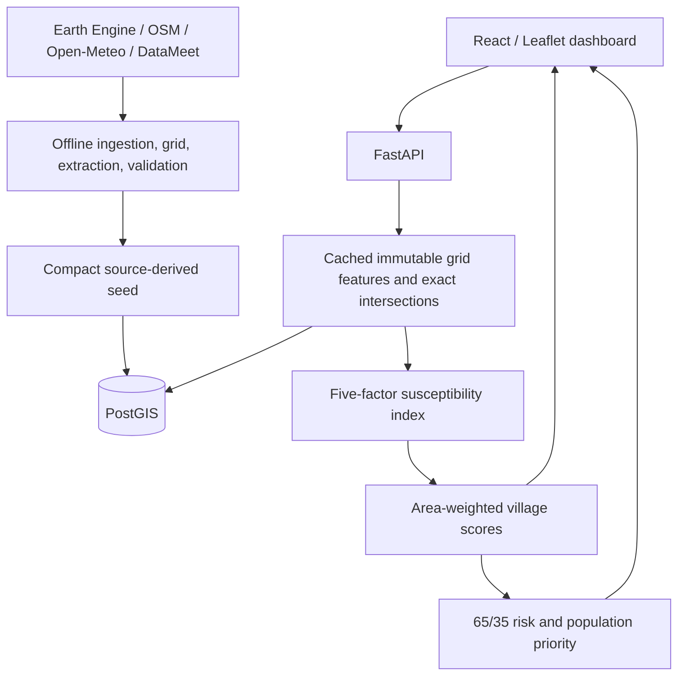

# Architecture

## Spatial processing

Distances and areas use EPSG:32643. The regular 250 m grid contains 38,083 cells; 47,843 exact cell–village intersections preserve aggregation weights. Source-derived rasters/intermediates stay offline and ignored. The 3.9 MB seed restores 380 source settlements and related feature/evidence tables without Earth Engine access. Village GeoJSON is simplified by 15 m with topology preserved, converted to MultiPolygon and transformed to EPSG:4326.

## Runtime

FastAPI routers validate preset and team inputs. SQLAlchemy/pg8000 supplies a bounded pool. The risk service caches the fixed offline features, calls index-v1 per scenario and aggregates contributions and raw factors by intersection area. Restart workers after refreshing data. Priorities are computed on demand from current scores and database-stored weights; no stale priority-results table exists. Road accessibility is display context only.

React owns scenario, selected village and ranking state. AbortController and guarded updates discard superseded responses; team requests are debounced. Leaflet displays actual API polygons, river lines and priority outlines. Error/loading states cover unavailable or stale map data. Historical highlighting summarizes villages with observed SAR change and is explicitly not an extent boundary.

## Reproducibility and deployment

Docker Compose runs local PostGIS and FastAPI; Vite serves frontend development. Alembic versions immutable schema changes. Production preparation uses Vercel frontend → Render Docker API → Supabase PostGIS. Startup initializes an empty database, then serves the read-mostly app. Production CORS requires explicit HTTPS origins; database TLS verifies certificates. Database row-level security prevents anonymous managed-data-API access. Secrets never enter the frontend.

The full pipeline runs in a Linux container where Windows compiled scientific libraries are blocked by host Application Control. The policy was not changed. Automated tests use small fixtures plus real seeded PostGIS. The fresh-clone check used an independent volume and ports.
